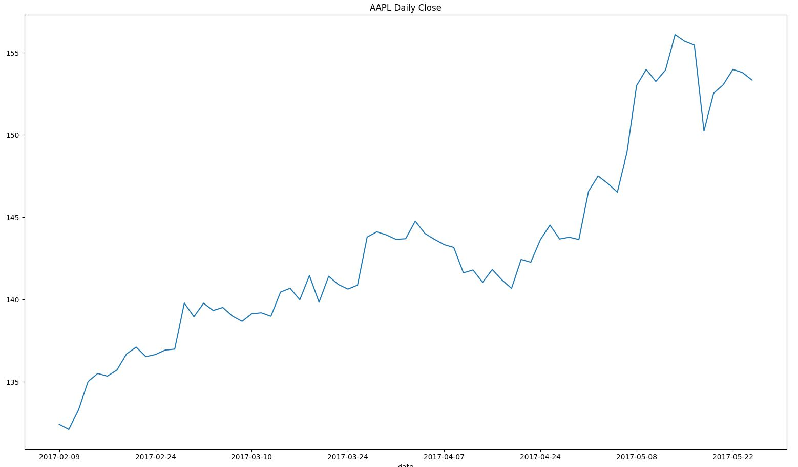

.. _historical:

.. currentmodule:: iexfinance

Historical Data
===============

Historical time series data is available through the top-level
``get_historical_data`` method, which sources the
`chart <https://iextrading.com/developer/docs/#chart>`__ endpoint.

.. autofunction:: get_historical_data

Data can be retrieved from up to 5 years before the current date.

Usage
-----

If no date parameters are passed, the start date will default to 2015/1/1
and the end date will default to the current date.

.. ipython:: python
    :okwarning:

    from iexfinance.stocks import get_historical_data
    from datetime import datetime

    start = datetime(2017, 2, 9)
    end = datetime(2017, 5, 24)

    f = get_historical_data('AAPL', start, end, output_format='pandas')
    f.loc["2017-02-09"]

Plotting
--------

With Pandas output formatting, we are able to plot historical price
movements using matplotlib.

.. ipython:: python

    from iexfinance.stocks import get_historical_data
    from datetime import datetime
    import matplotlib.pyplot as plt
    start = datetime(2017, 2, 9)
    end = datetime(2017, 5, 24)

    f = get_historical_data("AAPL", start, end, output_format='pandas')
    plt.plot(f["close"])
    plt.title('Time series chart for AAPL')
    plt.show()

